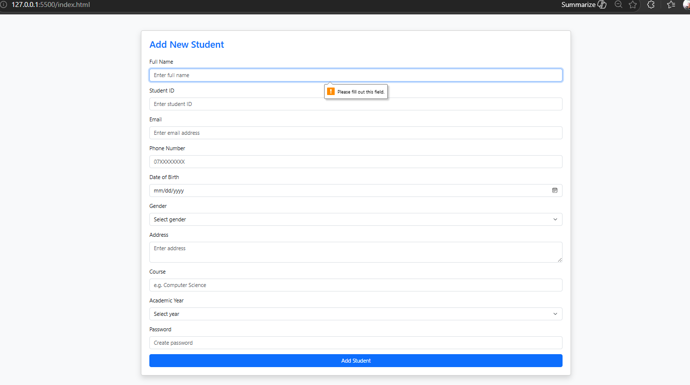
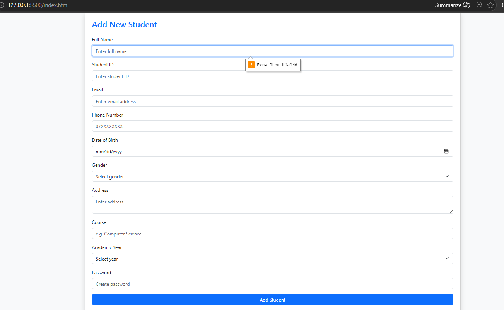
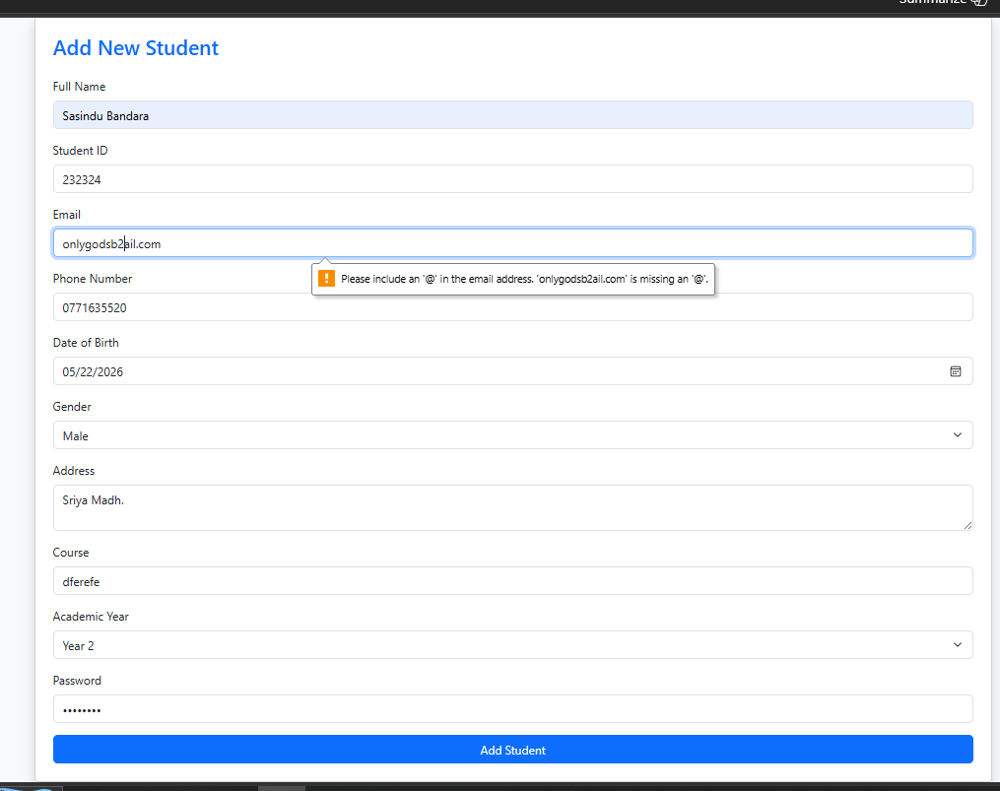
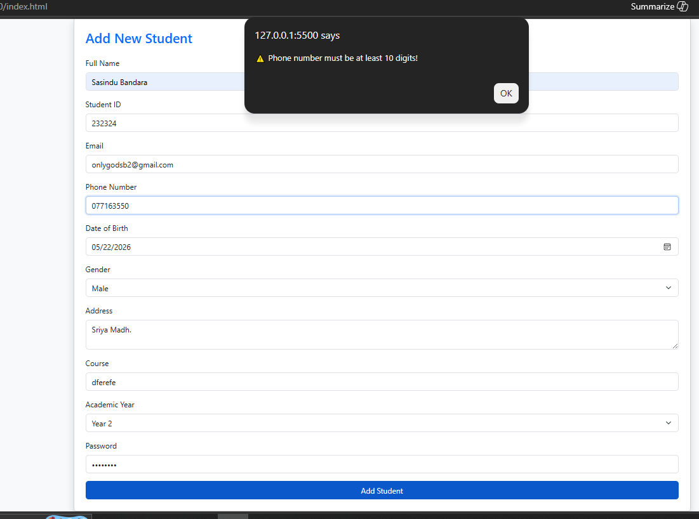
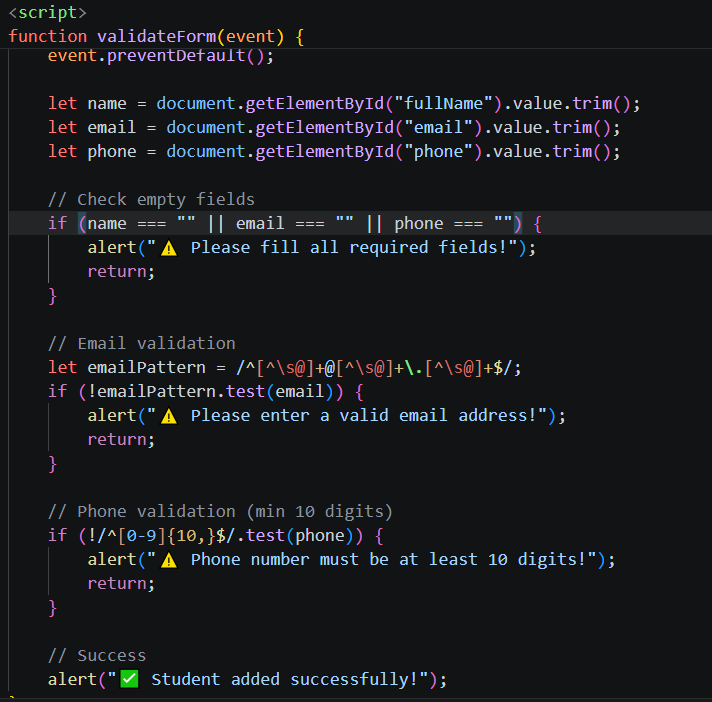
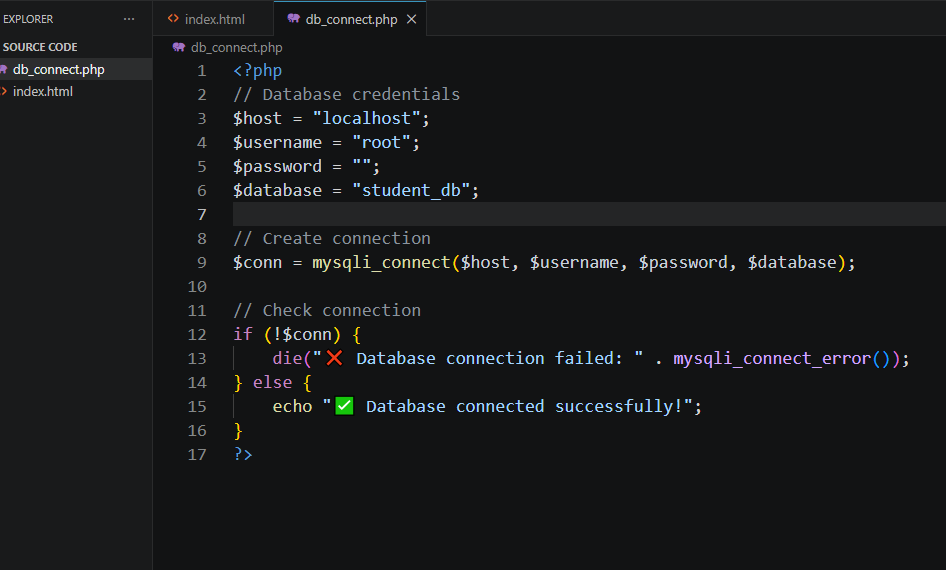
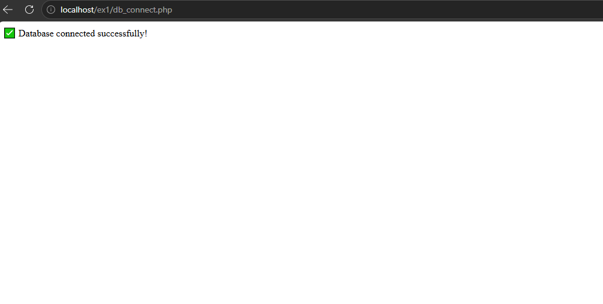

# Question 1 — Database Design (10 Marks)

## 🗄️ Task
Design a MySQL database named **`student_db`**.

---

## 📋 Requirements

### 1. Create Table
Create a table named **`students`** with the following fields:

- `student_id`
- `first_name`
- `last_name`
- `email`
- `phone`
- `address`
- `dob`
- `gender`
- `course`
- `admission_date`

---

### 2. Define Constraints
Apply appropriate data types and constraints such as:

- `PRIMARY KEY`
- `NOT NULL`
- `UNIQUE`
- `AUTO_INCREMENT` (if needed)

---

### 3. Insert Sample Data
Insert at least **3 student records** into the table.

---

## 📸 Required Screenshots

Attach the following screenshots:

1. **Database creation script**

.png)

3. **Table structure (students table)**

.png)

5. **Sample data view in phpMyAdmin**

.png)

.png)

---

# Question 2 — Identify HTTP Requests (5 Marks)

## 🌐 Task
Identify which HTTP request methods should be used for the following operations:

---

## 📋 Requirements

1. **Adding a student**  
2. **Viewing all students**  
3. **Updating student details**  
4. **Deleting a student**  

---

## 📸 Required Screenshot

## 📊 Answer Table

| Action                    | HTTP Method |
|--------------------------|------------|
| Add a student            | POST       |
| View all students        | GET        |
| Update student details   | PUT / PATCH|
| Delete a student         | DELETE     |

---

## 🧠 Explanation

- **POST** → Used to create new data (add student)  
- **GET** → Used to retrieve data (view students)  
- **PUT / PATCH** → Used to update existing data  
- PUT → full update  
- PATCH → partial update  
- **DELETE** → Used to remove data  

---

# Question 3 — Frontend UI Design (15 Marks)

Create a Bootstrap form for adding a new student.

Form must include all 10 fields with proper labels and placeholders.

## 📋 Requirements:

- Use Bootstrap form controls for styling.
- Add a submit button labeled “Add Student”.
- Use HTML5 validation attributes (like required, type="email", etc.).

## 📸 Attach screenshot:

•	The complete form displayed in browser.

---

# Question 4 — JavaScript Form Validation (10 Marks)

Add frontend validation using JavaScript.

## Checklist:

- Alert if required fields are empty.

- Validate correct email format.

- Validate phone number length (minimum 10 digits).

  
- Code snippet for validation.

---

# Question 5 — Backend Connection Setup (10 Marks)

Create a file named db_connect.php and connect your project to the student_db database.

## 📋 Requirements:

- Use mysqli_connect() or PDO.
- Display a message if the connection fails.

## 📸 Attach screenshot:
- Database connection code.

-	Proof of successful connection (output message or no error).

---

Question 6 — Insert Data into Database (15 Marks)

Create a PHP file (add_student.php) to insert form data into the students table.

📋 Requirements:
•	Use POST method.
•	Sanitize input values.
•	Display success or error messages.

📸 Attach screenshot:
•	Form submission
•	Alert/message after submission
•	Data appearing in phpMyAdmin

---

Question 7 — Display All Students (10 Marks)

Create a PHP page (view_students.php) that displays all students in a Bootstrap table.

📋 Requirements:
•	Retrieve data using SELECT query.
•	Show columns: ID, Name, Email, Phone, Course.
•	Add styling with Bootstrap.

📸 Attach screenshot:
•	Table displayed in browser with actual data.

---

Question 8 — Add Success/Error Alerts (5 Marks)

Use Bootstrap alert boxes to show messages for success and errors instead of plain JS alerts.

📸 Attach screenshot:
•	Alert message appearing after adding data successfully.

---

Question 9 — Optional Challenge: Update and Delete (Extra Marks)

Add buttons to update and delete student records.

•	“Edit” button should open form pre-filled with data.
•	“Delete” button should remove the record after confirmation.

📸 Attach screenshot:
•	Edit form view
•	Delete confirmation
•	Updated table after edit/delete

---

Question 10 — Project Folder Structure (5 Marks)

Organize your project files properly.

Example structure:
project/
│
├── backend/
│   ├── db_connect.php
│   ├── add_student.php
│
├── index.html
├── view_students.php
└── assets/
    ├── css/
    ├── js/

📸 Attach screenshot:
•	Folder structure from your code editor or file explorer.

---
